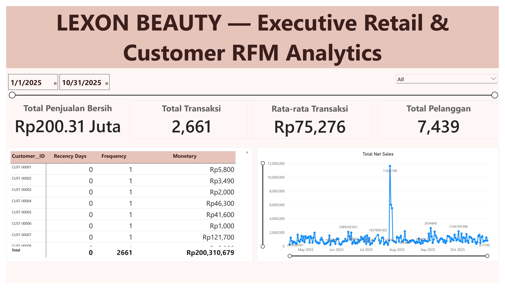

# Lexon Beauty — Customer Segmentation using RFM & K-Means Clustering

## 📌 Overview
This project performs an end-to-end data analytics solution applying **Unsupervised Machine Learning (K-Means Clustering)** and **RFM (Recency, Frequency, Monetary)** analysis to segment customers of **Lexon Beauty**. The final output integrates a data pipeline built in Python with an executive-level interactive dashboard created in **Power BI Desktop** to provide actionable marketing recommendations for business growth.

## 📊 Executive Dashboard Preview

## 🛠️ Tools & Libraries
- **Data Engineering & Machine Learning (Python 3.x):** 
  - Jupyter Notebook
  - Pandas & NumPy (Data manipulation & cleaning)
  - Scikit-learn (K-Means clustering, PCA, standard preprocessing)
  - Matplotlib & Seaborn (Exploratory statistical charts)
- **Data Modeling & Visualization (Power BI):**
  - Power BI Desktop (Star Schema data architecture)
  - DAX Measures (Dynamic currency formatting and KPI metrics)

## 📊 Dataset & Anonymization Notice
- **Source**: Real retail transaction details from MOKA POS (Lexon Beauty Store).
- **Total Raw Transactions**: 1,722 rows.
- **Data Cleaning Pipelines**:
  - Handled 35.4% missing Customer IDs.
  - Removed 272 anomaly/refund transactions to ensure revenue integrity.
  - Final valid unique customers for ML pipeline: **1,167** customers.
- **🔒 Corporate Privacy Compliance**: Raw data containing sensitive Personal Identifiable Information (PII) such as real customer names, phone numbers, and staff names has been completely stripped out and masked using unique secure indexing code (`CUST-00001`) during the Power Query ETL processing.

## 📈 Project Methodology & Architecture
1. **Data Cleaning & Masking:** Handled missing values, formatted chronological locale fields, and removed transaction anomalies.
2. **RFM Metrics Engineering:** Calculated exact Recency (days since last purchase), Frequency (distinct counts of transaction receipt numbers), and Monetary (total net sales spend) for each individual member profile.
3. **K-Means Clustering Evaluation:** Determined the optimal number of customer clusters using the Elbow Method.
4. **Cluster Validation:** Validated the statistical quality using the Silhouette Score algorithm.
5. **Dimensionality Reduction:** Used PCA (Principal Component Analysis) for 2D visual projection of clusters.
6. **Data Modeling (Star Schema):** Imported Python aggregated segment tables into Power BI as a dimension table (`One-to-Many` relationship) mapped against the transactional fact table to allow dynamic filtering.
7. **Business Recommendations:** Tailored operational strategies based on generated segment profiles.

## 🎯 Results & Business Insights

### Optimal Clusters: **3 Segments**

| Segment | Number of Customers | Key Characteristics | Strategic Business Recommendation |
|---------|--------------------|---------------------|-----------------------------------|
| **Loyal / Champion** | 208 | High Frequency & High Monetary, Low Recency (Highly Active) | Reward with premium tier loyalty programs, early access to new cosmetic product drops, and exclusive VIP offers. |
| **Promising** | 431 | Average transaction frequency, stable monetary contribution. | Encourage increased cross-selling and up-selling spending habits through personalized skincare routine product recommendations. |
| **At-Risk / Lost** | 528 | High Recency (Inactive for a long time), Low Frequency & low spend. | Run re-engagement win-back campaigns, utilize push notifications, and offer high-discount time-limited beauty promo vouchers. |

### Model & Analytics Performance
- **Machine Learning Model Validation:** **Silhouette Score of 0.36** (highly acceptable for real-world retail point-of-sale data containing commercial noise).
- **Dashboard Integrity:** Metrik dasar keuangan dan operasional teragregasi dinamis menggunakan formula DAX kustom tanpa adanya duplikasi data transaksi gantung:
  - **Total Penjualan Bersih:** `Rp200.31 Juta`
  - **Total Transaksi:** `2,661 Transaksi`
  - **Rata-rata Transaksi (AOV):** `Rp75,276`
  - **Total Pelanggan Aktif:** `7,439 Pelanggan`

## 🚀 How to Open the Project
1. Clone this repository to your local computer.
2. Open `RFM_Model_Analysis.ipynb` inside Jupyter Notebook/Google Colab to view the complete Python data science workflow.
3. Open `Power BI/Lexon Beauty Dashboard.pbix` using **Power BI Desktop** to explore the fully functional interactive report, modify time ranges using the date slicer, or drill down into individual customer segmentation profiles.
